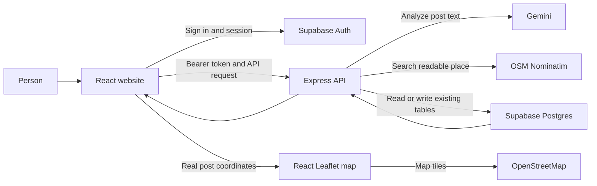

# Techtonix Website Workflow

This document describes how the website is intended to work and how the current implementation moves data. It distinguishes tested behavior from flows that still need an authenticated end-to-end test.

## 1. System Overview

- **Frontend:** React and Vite, normally at `http://localhost:5173`.
- **Application API:** Node and Express, normally at `http://localhost:5000`.
- **Authentication and persistence:** Supabase Auth and the existing Supabase Postgres tables.
- **Post analysis:** Gemini, called by the server.
- **Place lookup:** OpenStreetMap Nominatim, called by the server.
- **Map display:** React Leaflet and OpenStreetMap tiles in the browser.

The normal application-data path is:



The frontend should use Express for application data. It should not insert posts directly into Supabase.

## 2. Public Browse Flow

1. The browser loads the React app and its route shell in [App.jsx](client/src/App.jsx).
2. The app requests the feed from `GET /api/posts` through [api.js](client/src/lib/api.js).
3. Express validates the optional category and search query, then reads posts from Supabase using [posts.js](server/src/routes/posts.js) and [postService.js](server/src/services/postService.js).
4. The API formats the returned rows. The app stores them in its shared state.
5. [Home.jsx](client/src/pages/Home.jsx) renders the feed, search input, category filters, and map from that same state.
6. Search and category selection filter the posts currently in the browser. Refresh requests the API again.
7. Selecting a post opens `/post/:id`. The detail page uses the post in app state and shows its location, urgency, expiry, and map context.

If the API fails, the intended behavior is an error/empty state, not substituting fixture posts as if they were live community data.

## 3. Authentication Flow

1. A user enters credentials on Login or Signup.
2. [AuthContext.jsx](client/src/context/AuthContext.jsx) calls Supabase Auth and holds the resulting session.
3. Protected routes, including post creation, require a signed-in user.
4. Before an API request, [api.js](client/src/lib/api.js) reads the current Supabase access token and sends it as `Authorization: Bearer ...`.
5. Express auth middleware validates that token with Supabase before allowing protected operations.

**Current blocker:** in the browser test, the Login and Signup buttons did not submit the forms or send an Auth request. The shared button defaults to `type="button"` while the form handler depends on a submit event. Until that is corrected and retested, authenticated creation and interaction flows cannot be completed through the UI.

## 4. Create and Analyze a Post

1. A signed-in user opens `/create` and enters a natural-language description in [PostForm.jsx](client/src/components/PostForm.jsx).
2. The user clicks AI Analyze. [CreatePost.jsx](client/src/pages/CreatePost.jsx) sends the text to `POST /api/ai/analyze-post`.
3. The route in [ai.js](server/src/routes/ai.js) checks authentication, rate limits the request, validates the text, and calls [aiService.js](server/src/services/aiService.js).
4. Gemini returns structured post fields: title, category, readable location, urgency, tags, and suggested expiry. The prompt does not ask Gemini for coordinates.
5. The AI service passes Gemini's location text to [geocodingService.js](server/src/services/geocodingService.js). Nominatim returns a readable result plus latitude and longitude when it finds a match.
6. The AI response contains both location and coordinates. If no place is resolved, it can return the readable location with `latitude` and `longitude` set to `null`.
7. The frontend fills the review form. The user can edit the suggested title, category, location, urgency, expiry, and tags before publishing.
8. Editing the location clears the previously analyzed coordinates so they are not accidentally reused for a different place.
9. The optional GPS control calls `navigator.geolocation.getCurrentPosition()` only after the user clicks it. GPS coordinates are separate from the readable post location.

### Current Geocoding Fallback

The current [geocodingService.js](server/src/services/geocodingService.js) tries:

1. The extracted location as-is.
2. The same search with `, Mumbai` appended if the text does not already include Mumbai or India.
3. A Gemini-generated search phrase, then another Nominatim lookup.

Gemini supplies place-search text in the final fallback, not coordinates. The Mumbai context can be inaccurate for posts outside Mumbai, so geocoder results should be reviewed and this fallback should be made location-neutral if the app serves other regions.

## 5. Publish and Persist

1. The user clicks Publish. The frontend validates required fields and sends title, description, category, readable location, latitude, longitude, urgency, tags, expiry, and anonymity to `POST /api/posts`.
2. [posts.js](server/src/routes/posts.js) requires authentication and validates the payload against [postSchemas.js](server/src/schemas/postSchemas.js).
3. [postService.js](server/src/services/postService.js) ensures the user's profile exists and checks the coordinate pair.
4. Missing, empty, non-numeric, or out-of-range coordinates are not accepted as a valid pair. This matters because `Number(null)` in JavaScript evaluates to `0`.
5. If coordinates are invalid but a readable location exists, the service asks Nominatim to geocode that location again.
6. If Nominatim resolves the place, the service updates the readable location and sends the numeric coordinates to Supabase. If it cannot resolve it, the service preserves the readable location and writes `NULL` for both coordinate columns.
7. The existing `posts` table receives the insert, including `latitude` and `longitude`. No new tables or schema changes are required.
8. Supabase returns the inserted row. Express formats it and returns it to the browser.
9. The app adds the returned row to shared state and returns to the feed. A later refresh or page reload fetches posts from the API again.

## 6. Leaflet Map Flow

[MapPreview.jsx](client/src/components/MapPreview.jsx) is used on the feed and post-detail pages. It imports `react-leaflet`, Leaflet, and `leaflet/dist/leaflet.css`.

- The map panel has an explicit height through the existing `.map-surface` CSS.
- A post is eligible for a marker only when both coordinate fields are non-null, finite numbers within valid latitude/longitude bounds.
- Coordinates are converted to numbers before being given to Leaflet.
- The initial view is based on a real post coordinate or on the user's explicitly requested GPS location; there is no hardcoded campus coordinate.
- With no mappable posts and no GPS location, the panel shows an empty state rather than a fake marker or fabricated center.
- A marker popup shows the post title, category, readable location, and urgency. Anonymous posts do not reveal author identity.
- The map requests OpenStreetMap tiles separately from Nominatim's geocoding requests.

## 7. Other Post Actions

The API also has protected routes for votes, validity checks, reports, and resolving posts. Having a backend route does not guarantee the matching UI action is wired to it. In the prior browser check, some detail-page actions only changed local UI state or showed a toast, and Contact poster did not perform an action. Treat those as incomplete until the browser sends the corresponding API request and the response is reflected in persisted data.

## 8. Verification Notes

Previously verified:

- A real Gemini analysis of `Lost my ID card near DBIT Kurla` extracted the place and returned Nominatim coordinates `19.0818773, 72.8881974` with the readable result `DBIT Buildings, Don Bosco Campus Road, Premier Colony`.
- A stubbed Supabase client confirmed those coordinates were present in the insert payload. A no-match location remained readable and produced `NULL` coordinates.
- An OpenStreetMap tile request returned an image successfully.
- The map rendered its no-location empty state with no fake markers when the live posts had no coordinates.
- `npm run build` passed. Vite reported a large JavaScript bundle warning.

Not verified end-to-end:

- The shared browser did not have an authenticated session. An unauthenticated `POST /api/posts` correctly returned `401`, so no test post was created in Supabase.
- The live feed contained four posts with `NULL` coordinates at the time of the check. The map therefore had no real post markers to display.
- The insert-payload check used a stubbed database client; it did not prove that a new database row was committed or that a marker rendered from that row.

## 9. Run Locally

Run these commands in separate terminals:

```powershell
cd server
npm run dev
```

```powershell
cd client
npm run dev
```

The client defaults to port `5173`; the API defaults to port `5000`. Build the frontend with:

```powershell
cd client
npm run build
```

## 10. Project Structure

This tree reflects the current workspace. Generated `node_modules`, build output, and Git internals are omitted. Environment file names are shown for orientation; do not put their contents or secrets in documentation.

```text
Techtonix/
|-- .agents/
|   `-- skills/
|       |-- supabase/
|       |   |-- assets/
|       |   |   `-- feedback-issue-template.md
|       |   |-- references/
|       |   |   `-- skill-feedback.md
|       |   |-- CHANGELOG.md
|       |   `-- SKILL.md
|       `-- supabase-postgres-best-practices/
|           |-- references/
|           |   |-- _contributing.md
|           |   |-- _sections.md
|           |   |-- _template.md
|           |   |-- advanced-full-text-search.md
|           |   |-- advanced-jsonb-indexing.md
|           |   |-- conn-idle-timeout.md
|           |   |-- conn-limits.md
|           |   |-- conn-pooling.md
|           |   |-- conn-prepared-statements.md
|           |   |-- data-batch-inserts.md
|           |   |-- data-n-plus-one.md
|           |   |-- data-pagination.md
|           |   |-- data-upsert.md
|           |   |-- lock-advisory.md
|           |   |-- lock-deadlock-prevention.md
|           |   |-- lock-short-transactions.md
|           |   |-- lock-skip-locked.md
|           |   |-- monitor-explain-analyze.md
|           |   |-- monitor-pg-stat-statements.md
|           |   |-- monitor-vacuum-analyze.md
|           |   |-- query-composite-indexes.md
|           |   |-- query-covering-indexes.md
|           |   |-- query-index-types.md
|           |   |-- query-missing-indexes.md
|           |   |-- query-partial-indexes.md
|           |   |-- schema-constraints.md
|           |   |-- schema-data-types.md
|           |   |-- schema-foreign-key-indexes.md
|           |   |-- schema-lowercase-identifiers.md
|           |   |-- schema-partitioning.md
|           |   |-- schema-primary-keys.md
|           |   |-- security-privileges.md
|           |   |-- security-rls-basics.md
|           |   `-- security-rls-performance.md
|           |-- CHANGELOG.md
|           `-- SKILL.md
|-- client/
|   |-- public/
|   |   |-- favicon.svg
|   |   |-- icons.svg
|   |   |-- manus-routes.json
|   |   |-- robots.txt
|   |   |-- sitemap.xml
|   |   `-- social-preview.svg
|   |-- src/
|   |   |-- assets/
|   |   |   |-- hero.png
|   |   |   |-- react.svg
|   |   |   `-- vite.svg
|   |   |-- components/
|   |   |   |-- AIAnalysis.jsx
|   |   |   |-- AuthForm.jsx
|   |   |   |-- Button.jsx
|   |   |   |-- CategoryFilter.jsx
|   |   |   |-- CookieConsent.jsx
|   |   |   |-- EmptyState.jsx
|   |   |   |-- ErrorMessage.jsx
|   |   |   |-- Footer.jsx
|   |   |   |-- Input.jsx
|   |   |   |-- Loading.jsx
|   |   |   |-- MapPreview.jsx
|   |   |   |-- Navbar.jsx
|   |   |   |-- PostCard.jsx
|   |   |   |-- PostForm.jsx
|   |   |   |-- PostList.jsx
|   |   |   |-- PostPreview.jsx
|   |   |   |-- ProtectedRoute.jsx
|   |   |   `-- SearchBar.jsx
|   |   |-- constants/
|   |   |   `-- institution.js
|   |   |-- context/
|   |   |   `-- AuthContext.jsx
|   |   |-- lib/
|   |   |   |-- analytics.js
|   |   |   |-- api.js
|   |   |   |-- supabase.js
|   |   |   `-- validation.js
|   |   |-- pages/
|   |   |   |-- CreatePost.jsx
|   |   |   |-- Home.jsx
|   |   |   |-- Login.jsx
|   |   |   |-- NotFound.jsx
|   |   |   |-- PostDetails.jsx
|   |   |   |-- Privacy.jsx
|   |   |   |-- Signup.jsx
|   |   |   `-- Terms.jsx
|   |   |-- utils/
|   |   |   |-- analytics.js
|   |   |   |-- categoryUtils.js
|   |   |   `-- formatDate.js
|   |   |-- App.jsx
|   |   |-- index.css
|   |   |-- main.jsx
|   |   |-- mockData.js
|   |   |-- style.css
|   |   `-- styles.css
|   |-- .env.example
|   |-- .env.local
|   |-- .gitignore
|   |-- .oxlintrc.json
|   |-- AGENTS.md
|   |-- app.config.ts
|   |-- index.html
|   |-- package.json
|   |-- package-lock.json
|   |-- plan.md
|   |-- README.md
|   `-- vite.config.js
|-- server/
|   |-- middleware/
|   |-- sql/
|   |   `-- init.sql
|   |-- src/
|   |   |-- lib/
|   |   |   |-- gemini.js
|   |   |   `-- supabase.js
|   |   |-- middleware/
|   |   |   |-- auth.js
|   |   |   |-- errorHandler.js
|   |   |   |-- rateLimiter.js
|   |   |   `-- validate.js
|   |   |-- routes/
|   |   |   |-- ai.js
|   |   |   |-- interactions.js
|   |   |   `-- posts.js
|   |   |-- schemas/
|   |   |   |-- interactionSchemas.js
|   |   |   `-- postSchemas.js
|   |   |-- services/
|   |   |   |-- aiService.js
|   |   |   |-- geocodingService.js
|   |   |   `-- postService.js
|   |   |-- utils/
|   |   |   `-- logger.js
|   |   `-- app.js
|   |-- .env
|   |-- .env.example
|   |-- .gitignore
|   |-- package.json
|   |-- package-lock.json
|   `-- server.js
|-- .gitignore
|-- architecture.md
|-- package.json
|-- package-lock.json
|-- skills-lock.json
`-- WORKFLOW.md
```
